# Nebula — Freelance work, settled on-chain

A production-shaped Stellar Soroban dApp: a freelance task marketplace where payment is escrowed in a smart
contract the moment a task is posted, released the moment it's approved, and where every platform fee
flows automatically into a staking pool that rewards anyone who's staked — via a real cross-contract call,
not a batch job.

Built for the Level 3 (Orange Belt) submission.

---

## Why this shape

Two contracts, not one, because the requirement is inter-contract communication with a real reason to
exist, not a token ping for its own sake:

- **`marketplace`** — escrow, task lifecycle (open → in_progress → submitted → completed/disputed/resolved),
  dispute arbitration.
- **`staking`** — a Synthetix/Curve-style fee-distribution accumulator. Stakers earn a share of every fee
  proportional to how much they've staked, without the contract ever looping over a staker list.

When a client approves a task, `marketplace::approve_task` transfers the fee to the staking contract's
balance and then calls `staking::deposit_fee` in the **same transaction** — so accounting can never drift
from the actual token balance the staking contract holds.

## Stack

| Layer | Tech |
|---|---|
| Smart contracts | Rust, Soroban SDK 21 |
| Backend | Node.js, Express, MongoDB/Mongoose, JWT, Helmet, Joi, Winston, WebSocket |
| Frontend | React 18, Vite, React Router, Context API, Framer Motion, Recharts, Tailwind, Lucide |
| Wallets | StellarWalletsKit (Freighter, Albedo, xBull) |
| CI/CD | GitHub Actions (contracts + backend + frontend, each with lint/test/build) |

## Repository layout

```
nebula/
├── contracts/              # Rust/Soroban smart contracts
│   ├── marketplace/        # Task escrow + lifecycle + dispute arbitration
│   ├── staking/             # Fee-distribution staking pool
│   └── scripts/deploy.sh   # Ordered deployment + wiring script
├── backend/                 # Node/Express API + on-chain event indexer
│   └── src/
│       ├── config/          # env, database
│       ├── controllers/     # request handlers
│       ├── services/        # authService, taskService, stellarService, indexerService
│       ├── models/          # Mongoose schemas
│       ├── middleware/      # auth, validation, rate limiting, error handling
│       └── routes/          # versioned REST routes (/api/v1)
├── frontend/                 # React/Vite SPA
│   └── src/
│       ├── pages/            # Landing, Dashboard, Marketplace, Wallet, etc.
│       ├── components/       # layout, ui, marketplace, wallet, charts
│       ├── context/          # Auth, Wallet, Toast
│       ├── hooks/             # useTasks, useRealtime, useContractTx
│       └── services/          # api.js, wallet.js
├── .github/workflows/ci.yml
└── docs/
    ├── ARCHITECTURE.md
    ├── DEPLOYMENT.md
    └── DEMO_SCRIPT.md
```

## Quickstart

### 1. Contracts

```bash
cd contracts
cargo test --workspace          # run all unit tests
cargo build --target wasm32-unknown-unknown --release
```

> **Note on this repo's provenance:** the contracts were written and reviewed carefully, but the
> environment they were authored in had no Rust toolchain available (sandboxed, no network access to
> rustup/crates mirrors beyond crates.io itself), so `cargo test` has **not** been run against them yet.
> Run it yourself before you rely on this for a submission — this is the single most important thing to
> verify locally. The backend and frontend, by contrast, **were** installed and tested in that same
> environment: `npm install`, `npm test`, `npm run build`, and `npx eslint` all ran clean for both, and one
> real bug (a `framer-motion` prop-forwarding issue in `GlassCard`) was caught and fixed by the test suite.

### 2. Backend

```bash
cd backend
cp .env.example .env      # fill in MONGO_URI, JWT_SECRET, contract ids after deployment
npm install
npm test                  # Jest + Supertest, in-memory MongoDB
npm run dev                # http://localhost:4000
```

### 3. Frontend

```bash
cd frontend
npm install
npm test                   # Vitest + Testing Library
npm run dev                 # http://localhost:5173
```

## Testing summary

| Suite | Tool | Count |
|---|---|---|
| `contracts/marketplace` | `cargo test` | 4 tests (lifecycle, cancel, dispute split, unauthorized submit) |
| `contracts/staking` | `cargo test` | 5 tests (stake, proportional fee split, claim, unstake, zero-staker guard) |
| `backend` | Jest + Supertest | 11 tests (auth flows, task listing/filtering/404) |
| `frontend` | Vitest + Testing Library | 6 tests (status rendering, amount formatting, routing) |

## Environment variables

See `backend/.env.example`. The frontend reads `VITE_API_URL`, `VITE_WS_URL`, and `VITE_STELLAR_NETWORK`
from a `.env` file or your deployment platform's environment settings.

## Deployment

See [`docs/DEPLOYMENT.md`](docs/DEPLOYMENT.md) for the full guide (contract deployment, Railway/Render for
the backend, Vercel for the frontend).

## Architecture

See [`docs/ARCHITECTURE.md`](docs/ARCHITECTURE.md) for the system diagram and a walkthrough of the
cross-contract call, the event-indexing pipeline, and the real-time update path.

## Security

See [`docs/SECURITY.md`](docs/SECURITY.md) for what's already hardened (auth checks, injection defenses,
CSP, rate limiting) and what's explicitly flagged as a follow-up rather than silently missing.

## API reference

See [`docs/API.md`](docs/API.md) for every REST endpoint and the WebSocket channel list.

## Contributing

See [`docs/CONTRIBUTING.md`](docs/CONTRIBUTING.md) for project conventions and the pre-PR checklist.

## Production hardening pass

Beyond the initial build, this project went through a second pass focused on things a senior engineer
would flag in review before calling it shippable:

- **Fixed a real, user-facing bug:** pagination was fetched from the API but never rendered — anyone
  browsing more than 12–24 tasks had no way to reach the rest. Added `components/ui/Pagination.jsx` and
  wired it in.
- **Fixed a real backend bug:** the Staking contract's `deposit_fee` event uses Soroban's 9-character
  `Symbol::short` (so its on-chain topic is literally `"fee"`, not `"fee_deposited"`), but the indexer and
  `Transaction` schema both assumed the longer name — every fee event would have failed Mongoose schema
  validation in production. Fixed by translating at the ingestion boundary (`indexerService.js`).
- **Fixed a real frontend bug (caught by the test suite):** `GlassCard`'s `motion[Tag]` lookup broke when
  `Tag` was a component reference (`Link`) instead of a string tag name.
- **Performance:** route-based code splitting cut the frontend's main JS bundle from **1.2MB to 29KB**,
  with vendor libraries (charts, wallet SDK, animation) split into independently-cacheable chunks. Verified
  with a real `vite build`, not estimated.
- **Security:** `express-mongo-sanitize`, `hpp`, a locked-down Helmet CSP, `trust proxy` (required for
  correct rate limiting behind Railway/Render/Vercel), an explicit method allowlist on the transaction-
  building endpoint, and a stronger password policy. Full list in `docs/SECURITY.md`.
- **Contracts:** added an admin-gated emergency `pause`/`unpause` on new escrow creation (in-flight tasks
  are unaffected) and an admin-adjustable, capped, fee-snapshotting `update_fee_bps` — both with new unit
  tests. Neither could be verified with `cargo test` in the authoring environment (see the note below); run
  the suite yourself before relying on them.
- **Accessibility:** modals now trap focus, close on Escape, and restore focus on close
  (`components/ui/Modal.jsx`); added a skip-to-content link, `aria-live` regions on loading/empty states,
  linked form labels throughout, and `prefers-reduced-motion` support in the orbit animation (previously
  only sped up by CSS, not actually stopped for JS-driven motion).
- **Resilience:** requests now time out via `AbortController` instead of hanging indefinitely; a 401
  response anywhere in the app now triggers a clean logout instead of failing silently on whatever request
  hit it; debounced search to cut redundant API calls while typing.
- **Code duplication:** extracted `frontend/src/utils/format.js` (stroop math, address/hash truncation,
  date formatting were previously copy-pasted across 5 files) and `backend/src/constants.js` (status/role/
  category enums previously retyped across the User/Task/Transaction models and their validation schemas).
- **Scalability:** the dashboard's aggregation query is now cached for 15s server-side rather than
  recomputed on every request; added a compound index for "my tasks" queries.

## Screenshots

### Landing Page
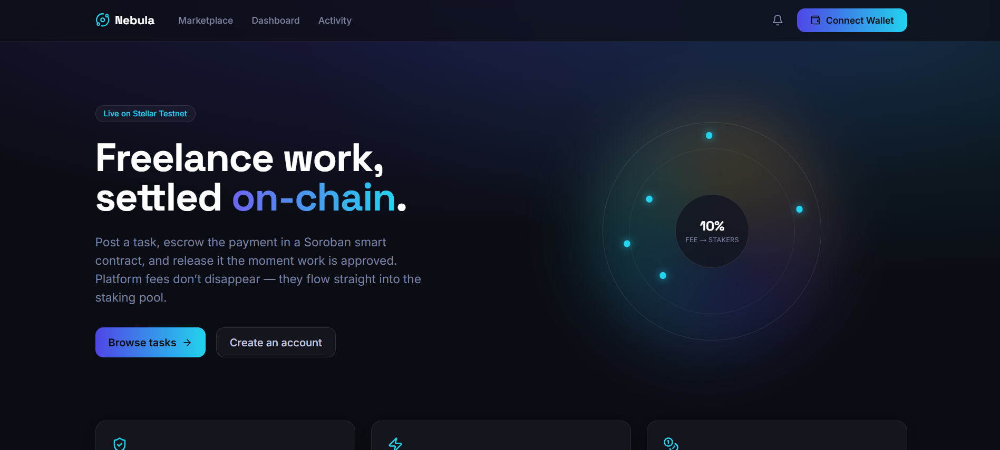

### Create Account
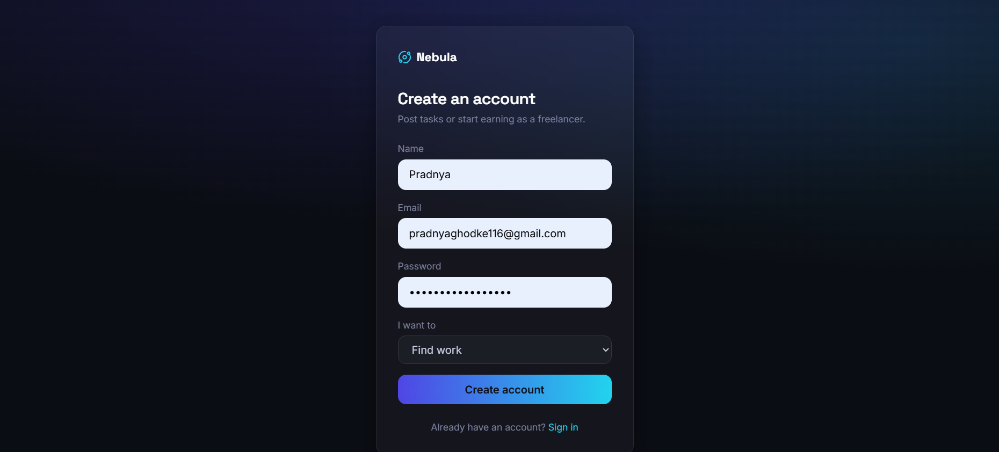

### Connect Wallet
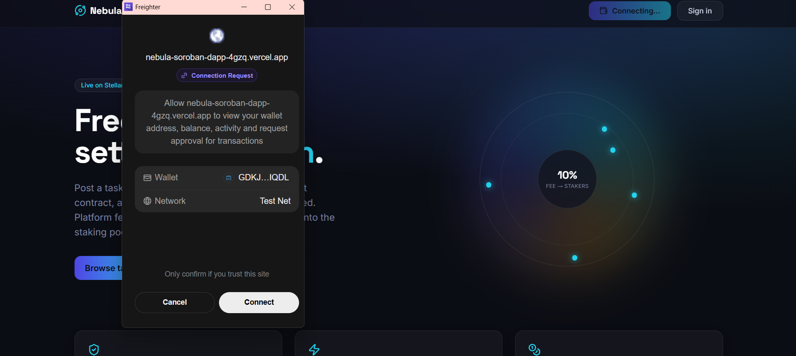

### Post a Task
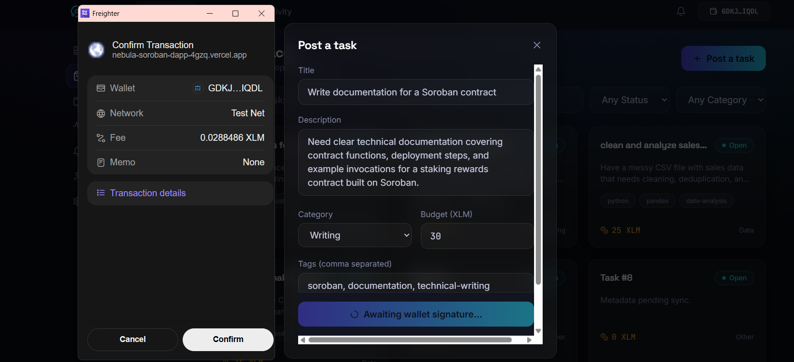

### Sign Transaction in Freighter
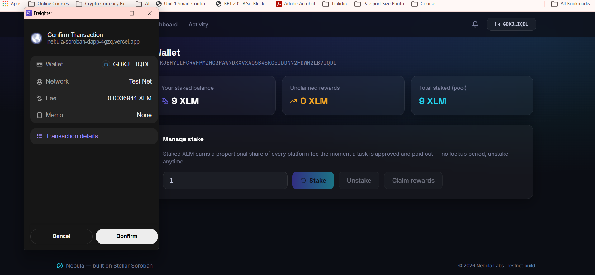

### Transaction Confirmed On-Chain
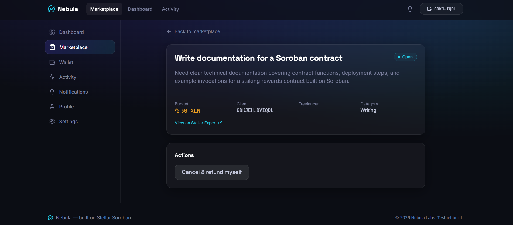

### View Transaction on Stellar Expert
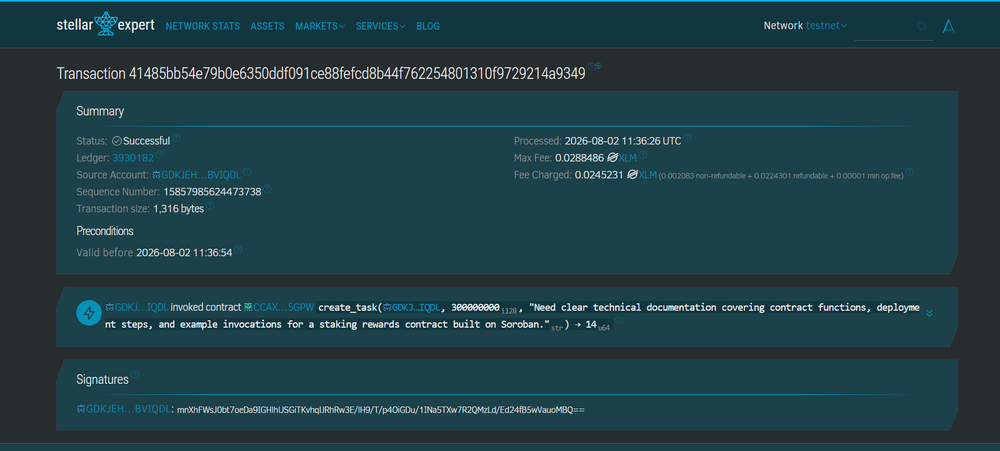

### Staking — Earn XLM
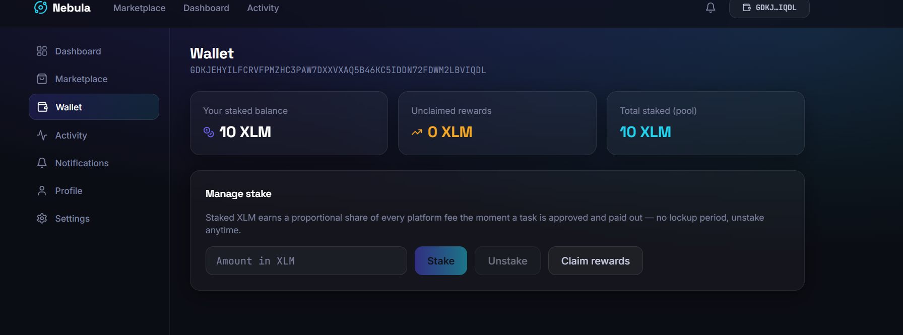

### Dashboard Overview
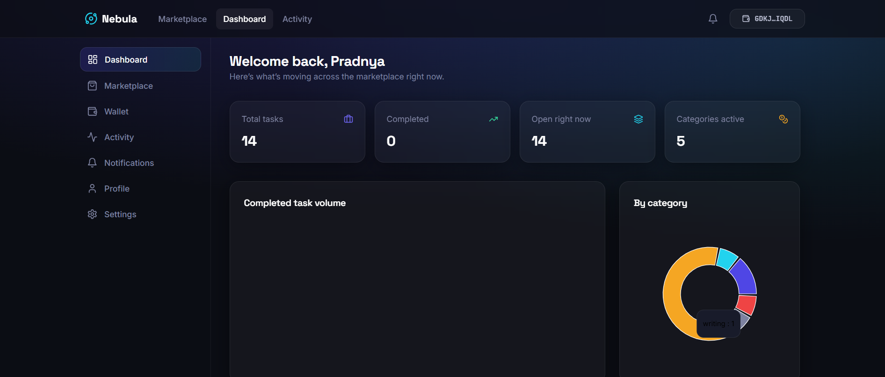

### Activity History Log
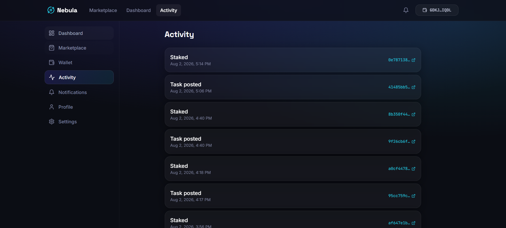

### Linked Wallet in Profile
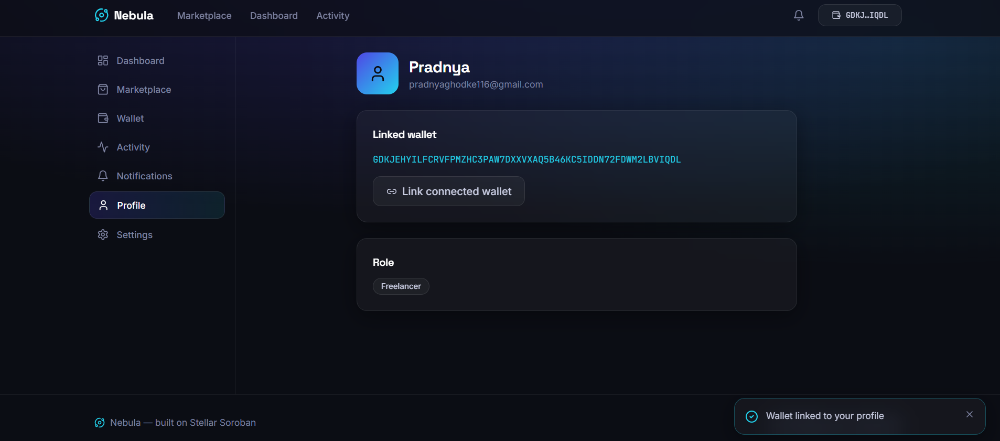

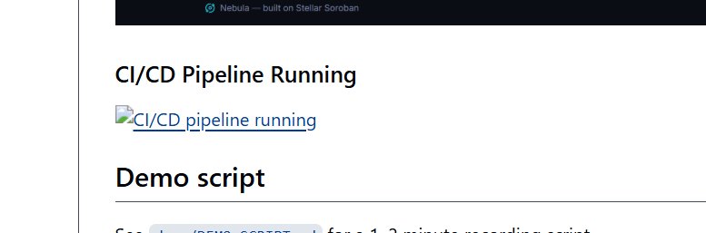


## Demo script

See [`docs/DEMO_SCRIPT.md`](docs/DEMO_SCRIPT.md) for a 1–2 minute recording script.

## License

MIT — built as a submission project; adapt freely.
