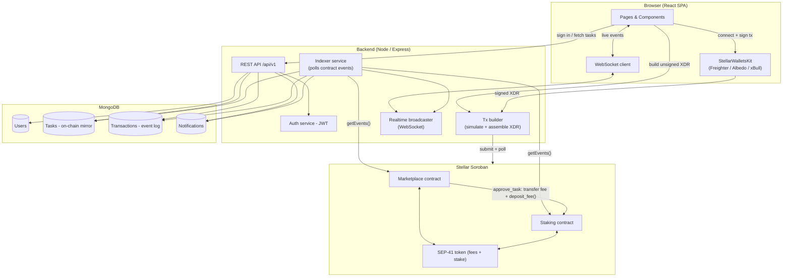

# Architecture

## System overview



## The cross-contract call, concretely

1. A client calls `marketplace::create_task`, escrowing the full task amount in the Marketplace
   contract's token balance.
2. A freelancer calls `accept_task`, then `submit_work`.
3. The client calls `approve_task`. Inside that single transaction, the Marketplace contract:
   - computes `fee = amount * fee_bps / 10_000`
   - transfers `amount - fee` to the freelancer
   - transfers `fee` to the Staking contract's own balance
   - invokes `staking::deposit_fee(marketplace_address, fee)` via a **typed client**
     (`StakingContractClient`, generated from the staking crate and imported as a workspace dependency)
4. Inside `deposit_fee`, the Staking contract folds `fee` into `reward_per_token_stored`, an accumulator
   scaled by a fixed-point `PRECISION` constant. Every staker's `earned()` is then just
   `staked_balance * (reward_per_token_stored - reward_per_token_paid) / PRECISION`, plus whatever was
   already snapshotted — no loop over stakers, so gas is O(1) regardless of how many people are staking.

This is deliberately **atomic**: if the Staking contract has zero stakers, `deposit_fee` fails, and because
it's called from within `approve_task`, the *entire* task-approval transaction reverts. The Marketplace
contract never silently swallows an unfollowed fee.

## Event indexing & real-time updates

The chain is the source of truth; MongoDB is a read-optimized mirror. `indexerService.js` polls
`getEvents()` on both contracts on an interval (default 5s), starting from the last ledger it successfully
processed (persisted in `IndexerState`). For each event it:

1. Writes an immutable row to `Transaction` (idempotent via `upsert` on `txHash`).
2. Applies the corresponding state transition to the `Task` mirror (e.g. `task_accepted` → sets
   `status: 'in_progress'` and records the freelancer's address).
3. Creates a `Notification` for the relevant user, if any.
4. Pushes the event out over WebSocket to any subscribed browser tab, so the dashboard, marketplace list,
   task detail page, and activity feed all update without a refresh.

## Why a mirror instead of reading the chain directly on every page load

Full-text search, filtering, and pagination over Soroban contract storage isn't practical — there's no
query language, only key-based reads. The mirror exists purely so `GET /tasks?search=...&category=...` can
be a real, fast, indexed MongoDB query. Anything that touches money (create/accept/submit/approve/cancel/
dispute) still reads and writes the contract directly through the wallet; the mirror never becomes a
back door for mutating state.

## Backend request layers

```
routes/  →  middleware (auth, validate, rate limit)  →  controllers  →  services  →  models
```

Controllers stay thin (parse request, call one service method, shape the response). Services own business
logic and are the only layer that touches Mongoose models or the Stellar SDK directly, so unit-testing a
service never requires spinning up Express.
